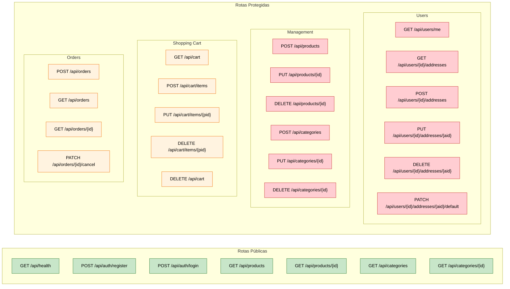
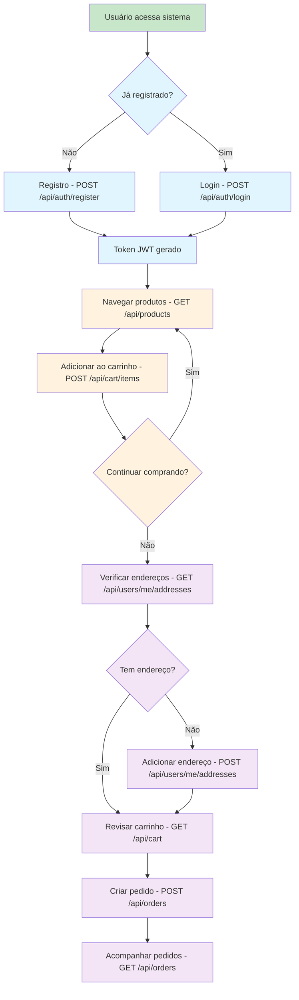

# API Endpoints Overview - Go Cart API

## 🗺️ Mapa de Endpoints

```mermaid
graph LR
    subgraph "Rotas Públicas"
        A["GET /api/health"]
        B["POST /api/auth/register"]
        C["POST /api/auth/login"]
        D["GET /api/products"]
        E["GET /api/products/{id}"]
        F["GET /api/categories"]
        G["GET /api/categories/{id}"]
    end
        subgraph "Rotas Protegidas"
        subgraph "Users"
            H["GET /api/users/me"]
            I["GET /api/users/{id}/addresses"]
            J["POST /api/users/{id}/addresses"]
            K["PUT /api/users/{id}/addresses/{aid}"]
            L["DELETE /api/users/{id}/addresses/{aid}"]
            M["PATCH /api/users/{id}/addresses/{aid}/default"]
        end
        
        subgraph "Management"
            N["POST /api/products"]
            O["PUT /api/products/{id}"]
            P["DELETE /api/products/{id}"]
            Q["POST /api/categories"]
            R["PUT /api/categories/{id}"]
            S["DELETE /api/categories/{id}"]
        end
        
        subgraph "Shopping Cart"
            T["GET /api/cart"]
            U["POST /api/cart/items"]
            V["PUT /api/cart/items/{pid}"]
            W["DELETE /api/cart/items/{pid}"]
            X["DELETE /api/cart"]
        end
        
        subgraph "Orders"
            Y["POST /api/orders"]
            Z["GET /api/orders"]
            AA["GET /api/orders/{id}"]
            BB["PATCH /api/orders/{id}/cancel"]
        end
    end

    %% Styling
    classDef public fill:#c8e6c9,stroke:#2e7d32,color:#000
    classDef protected fill:#ffcdd2,stroke:#c62828,color:#000
    classDef commerce fill:#fff3e0,stroke:#ef6c00,color:#000
    
    class A,B,C,D,E,F,G public
    class H,I,J,K,L,M,N,O,P,Q,R,S protected
    class T,U,V,W,X,Y,Z,AA,BB commerce
```

##  Fluxo do E-commerce

```mermaid
graph TD
    A[ Usuário acessa sistema] --> B{Já registrado?}
    B -->|Não| C[ Registro - POST /api/auth/register]
    B -->|Sim| D[ Login - POST /api/auth/login]
    
    C --> E[ Token JWT gerado]
    D --> E
    
    E --> F[ Navegar produtos - GET /api/products]
    F --> G[ Adicionar ao carrinho - POST /api/cart/items]
    
    G --> H{Continuar comprando?}
    H -->|Sim| F
    H -->|Não| I[ Verificar endereços - GET /api/users/me/addresses]
    
    I --> J{Tem endereço?}
    J -->|Não| K[ Adicionar endereço - POST /api/users/me/addresses]
    J -->|Sim| L[ Revisar carrinho - GET /api/cart]
    
    K --> L
    L --> M[ Criar pedido - POST /api/orders]
    M --> N[ Acompanhar pedidos - GET /api/orders]
    
    %% Styling
    classDef start fill:#c8e6c9
    classDef auth fill:#e1f5fe
    classDef shop fill:#fff3e0
    classDef order fill:#f3e5f5
    
    class A start
    class B,C,D,E auth
    class F,G,H shop
    class I,J,K,L,M,N order
```
